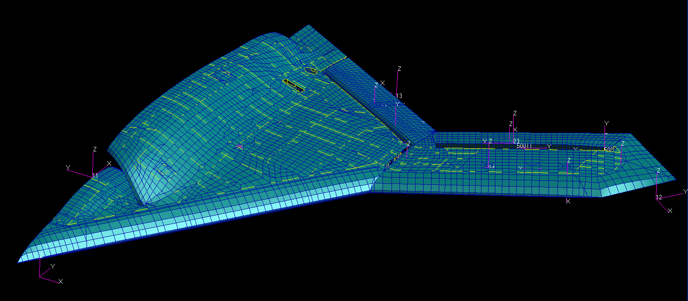
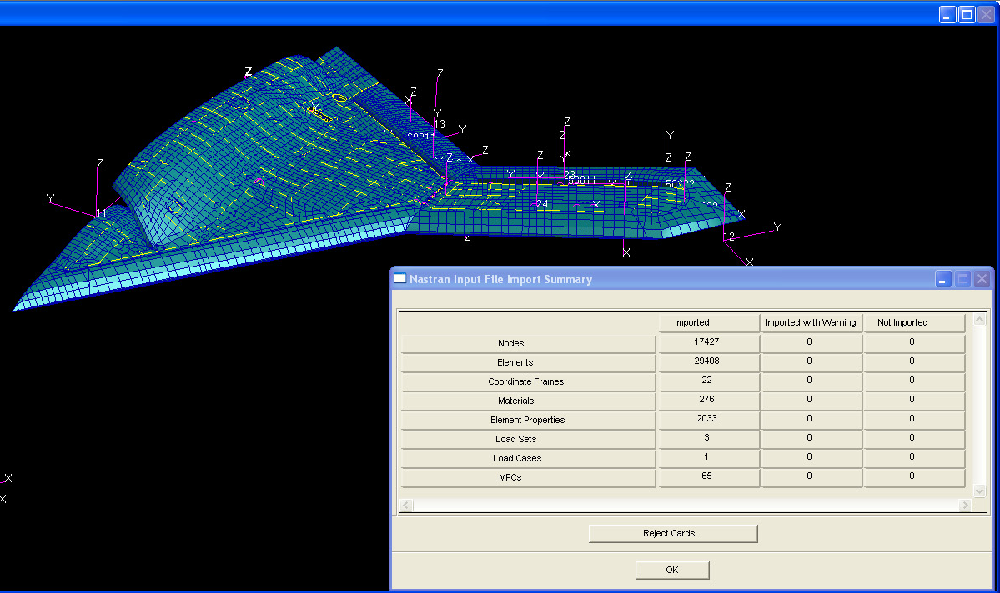
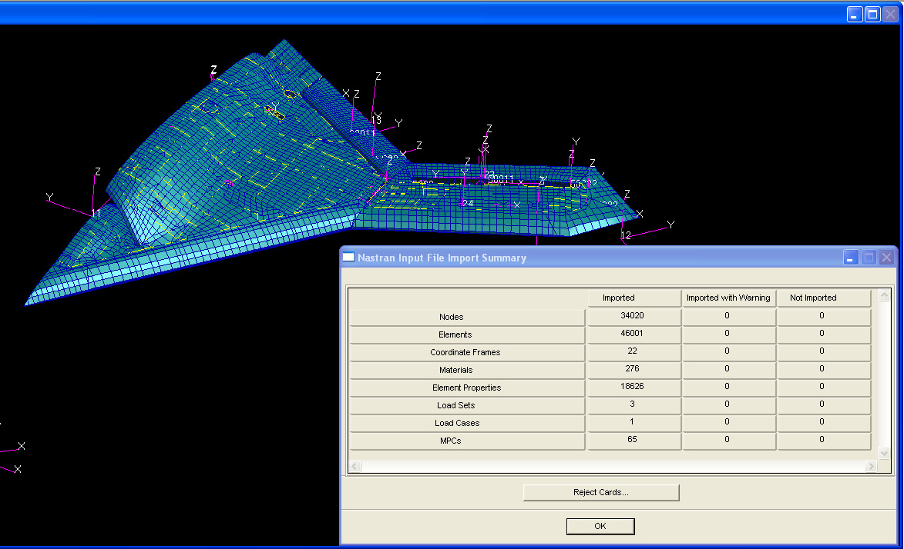
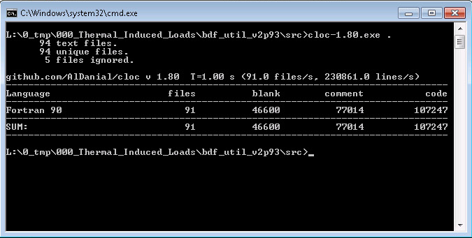
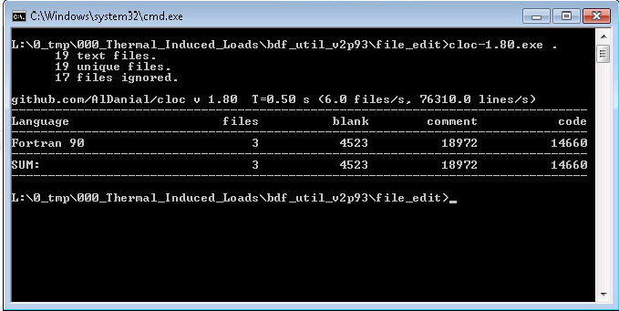

# ========================================
# Utility For AV Thermally Induced Loads Analysis For AV Mission Profiles (107K+ LOC):
# ========================================

## Thermal Analysis Methodology Employed In Thermally Induced Loads Determination For Air Vehicle Mission Profiles In A Distributed Processing Environment -
### A utility was developed which used as input a structural FEM loads model,

### NASTRAN FEM Loads Model Input File: "./input_bdf_util_TIL/input.bdf"
### # Nodes: 17,427
### # Elements: 29,408
### # Coordinate Frames: 22
### # Materials: 276
### # Element Properties: 2,033
### # Load Sets: 1
### # MPCs: 65

##
### ...and generated two outputs: 

### i. the first output being an updated structural FEM model incorporating additional degrees-of-freedom allowing for previous connectivity of elements of differing material properties,

### Thermal Induced Loads Utility Output NASTRAN File: "./output_bdf_util_TIL/output.bdf"
### # Nodes: 34,020
### # Elements: 46,001
### # Coordinate Frames: 22
### # Materials: 276
### # Element Properties: 18,626
### # Load Sets: 1
### # MPCs: 65

##
### ii. and the second output being a thermal lumped-parameter equivalent model used for the purpose of supplying temperature data corresponding to each FEM node in the original and updated structural FEMs. 

### SINDA Output File: "./output_file_edit/all.sin"
### # Nodes: 34,221
### # Conductors: 269,890
### # VARIABLES 1: 201,670

#
### a) The utility calculated equivilent orthogonal conductivities based upon composite layup data contained in the structural FEM. 
### b) The utility subdivided interior sub-volumes and computes convective and 1st-order radiative couplings on an element-by-element basis, accounting for each side of 2D elements and bar elements typically utilized for flanges, each coupled to the appropriate local bay ventilation node. 
### c) The utility took as input the mass-properties database and allocated non-structural mass to the appropriate local bay ventilation node. 
### d) The utility applied exterior air vehicle convective couplings on a node-by-node basis, based upon correlation and exterior nodal distance from leading edge associated with the nodal butt-line coordinate. 
### e) The utility applied exterior air vehicle 1st-order radiative couplings to background sky and earth node boundary conditions. 
### f) The utility added additional nodes and connecting springs at locals of elements of differing material properties, the stiffness of which was derived from the original structural FEM, establishing minimum and maximum stiffness threshold values on a node-by-node basis, such that the original FEM behavior was maintained and allowing numerical convergence of the updated FEM. 
### g) The product thermal lumped-parameter model was evaluated over air vehicle mission profile/atmosphere model assumption in a stepwise quasi-transient employing steady-state analysis in a distributed processing environment comprised of unused desktop PC cpu-cycles, utilizing fully transient FTMS fuel temperature analysis results and mission profile/atmosphere model timeline as boundary conditions, output being FEM nodal temperature versus mission profile timeline, which were then applied as boundary conditions to the updated output structural FEM.  
### h) The utility "integrated" the structural stress analysis with the thermal analysis beyond "traditional" approach, allowing for one-to-one nodal correspondence between the stress model and the thermal model.  
### i) The use of the distributed processing environment allowed for the integration of the FTMS model, structural thermal model, and the ventilation model to be analyzed over the entire air vehicle mission profile in a timely manner.

##
## I. Thermal Induced Loads Utility Executable (107K+ LOC): "./bin/bdf_util_TIL.exe"

##
## II. File Edit Utility Executable (14K+ LOC): "./bin/file_edit.exe"

##
## III. Thermal Induced Loads Utility Input Files:
### III.a. "./input_bdf_util_TIL/input.bdf"
### III.b. "./input_bdf_util_TIL/all_vehicle_represented_elements_only.bdf"
### III.c. "./input_bdf_util_TIL/bay_volume_data.bdf"
### III.d. "./input_bdf_util_TIL/fuel_tanks_all.bdf"
### III.e. "./input_bdf_util_TIL/fuel_tanks_all_no_skins.bdf"
### III.f. "./input_bdf_util_TIL/fuel_tank_1L.bdf"
### III.g. "./input_bdf_util_TIL/fuel_tank_2L.bdf"
### III.h. "./input_bdf_util_TIL/fuel_tank_3L.bdf"
### III.i. "./input_bdf_util_TIL/fuel_tank_4L.bdf"
### III.j. "./input_bdf_util_TIL/LB_stiffness.dat"
### III.k. "./input_bdf_util_TIL/Non_Structural_Weight.dat"
### III.l. "./input_bdf_util_TIL/skin_elements_wo_solid_elements.bdf"
### III.m. "./input_bdf_util_TIL/skin_to_substructure.bdf"
### III.n. "./input_bdf_util_TIL/skin_to_substructure_connection.sin"
### III.o. "./input_bdf_util_TIL/subset_list.dat"
### III.p. "./input_bdf_util_TIL/unconnected_nodes.sin"

##
## IV. Thermal Induced Loads Utility Output Files:
### IV.a. "./output_bdf_util_TIL/output.bdf"
### IV.b. "./input_file_edit/bay_cond_block.out"
### IV.c. "./input_file_edit/bay_non_structural_mass_qdot.out"
### IV.d. "./input_file_edit/bay_varb1_block_a.out"
### IV.e. "./input_file_edit/conductors_material_diffs.out"
### IV.f. "./input_file_edit/unconnected_nodes.out"

##
## V. File Edit Input Files:
### V.a. "./input_file_edit/bay_cond_block.out"
### V.b. "./input_file_edit/bay_non_structural_mass_qdot.out"
### V.c. "./input_file_edit/bay_varb1_block_a.out"
### V.d. "./input_file_edit/conductors_material_diffs.out"
### V.e. "./input_file_edit/unconnected_nodes.out"
### V.f. "./input_file_edit/part_1.inp"
### V.g. "./input_file_edit/part_2a.inp"
### V.h. "./input_file_edit/part_2b.inp"
### V.i. "./input_file_edit/part_3.inp"
### V.i. "./input_file_edit/part_4.inp"

##
## VI. File Edit Output File: "./output_file_edit/all.sin"

